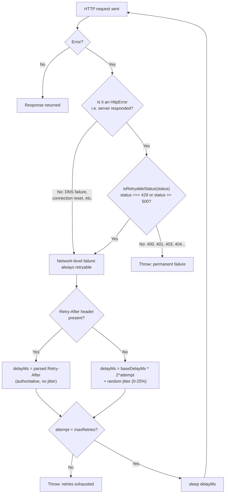

# DevRel Article 3: Resilient HTTP Retry Strategies

*This is an enhanced edition of the original article with an added architecture diagram and Python example; the underlying technical content is unchanged.*

## Dev.to / Medium version

**Title:** Resilient HTTP Retry Strategies: 3 Real Bugs Found Fixing Retry Logic Across 17 Scrapers

**Tags:** #http #nodejs #typescript #resilience #webscraping

---

### Retry logic looks simple until you actually audit it

"Retry on failure with exponential backoff" is one of those patterns everyone thinks they've implemented correctly, because the happy path — a transient failure, a retry, success — is easy to write and easy to eyeball-verify. The bugs live in the edge cases nobody eyeballs: which status codes actually deserve a retry, whether the server's own `Retry-After` header gets honored, and whether a genuinely permanent failure gets retried anyway and wastes your retry budget.

Auditing retry logic across a fleet of 17 Apify Actors this session surfaced three real bugs — one critical, two lower-severity but real. Here's each one, with the actual before/after code.

### Bug 1 (critical): HTTP 429 excluded from retry entirely

The original code:

```typescript
if (error instanceof HttpError && error.status >= 400 && error.status < 500) {
    throw error; // don't retry ANY 4xx
}
```

This looks reasonable at a glance — "don't retry client errors" is a defensible general rule. The problem: **429 (Too Many Requests) is a 4xx status code, and it is exactly the case retry logic exists for.** A rate-limited request under this code failed immediately instead of backing off — the opposite of the intended behavior, on the one status code where retrying is unambiguously correct.

The fix: carve 429 out explicitly, alongside 5xx, before the generic 4xx-skip rule applies:

```typescript
function isRetryableStatus(status: number): boolean {
    return status === 429 || status >= 500;
}

// ... in the retry loop:
if (error instanceof HttpError && !isRetryableStatus(error.status)) {
    throw error; // genuinely permanent - 400, 401, 403, 404, etc.
}
// 429 and 5xx fall through to the backoff-and-retry path below
```

### Bug 2: generic "retry any non-ok status" wastes budget on permanent errors

A different actor's retry logic had the opposite problem: it retried on *any* non-ok response, including a permanent 401 (bad credentials) or 404 (not found) — errors that will never succeed on retry no matter how many times you ask. Not a correctness bug (nothing gets silently dropped), but a real inefficiency: every retry attempt against a permanent error burns time and, on a rate-limited API, actual quota.

The fix: a typed error class that distinguishes a genuine HTTP-status failure (retryable only if 429/503) from a network-level failure (DNS, connection reset — always worth retrying, since those are inherently transient):

```typescript
class HttpError extends Error {
    constructor(message: string, public readonly status: number) {
        super(message);
        this.name = 'HttpError';
    }
}

// in the catch block:
if (error instanceof HttpError) throw error; // already decided above whether this was retryable
// only a genuine network-level failure reaches here
if (attempt < maxRetries) await sleep(baseDelayMs * 2 ** attempt);
```

### Bug 3: `Retry-After` never read

Several actors' retry logic used a fixed exponential backoff on 429/503 without ever checking whether the server told you exactly how long to wait. RFC 9110 defines `Retry-After` for exactly this — either a delay in seconds or an HTTP-date — and ignoring it means guessing at a delay the server already told you.

```typescript
function parseRetryAfterMs(headerValue: string | null): number | null {
    if (!headerValue) return null;
    const seconds = Number(headerValue);
    if (Number.isFinite(seconds)) return Math.max(0, seconds * 1000);
    const dateMs = Date.parse(headerValue);
    if (!Number.isNaN(dateMs)) return Math.max(0, dateMs - Date.now());
    return null;
}

// Retry-After is authoritative when present - the server told you exactly
// how long to wait, so a shorter computed backoff would just get
// rate-limited again.
const delayMs = error.retryAfterMs !== null ? error.retryAfterMs : computedBackoffMs;
```

### The real fix requires jitter too, if you might run concurrently

Pure exponential backoff with no randomization means every concurrent instance retrying the same failure retries at the exact same intervals — a thundering herd against the API you're trying to be polite to. A small random jitter fraction added to the computed backoff (not to a server-provided `Retry-After`, which is authoritative) fixes this cheaply:

```typescript
const backoffMs = baseDelayMs * 2 ** attempt;
const jitterMs = Math.random() * backoffMs * 0.25;
const delayMs = retryAfterMs ?? backoffMs + jitterMs;
```

### How it all fits together

The three fixes above are decisions made at different points of the same retry path. Composed into one flow — a network-level failure (no HTTP response) is always retryable, an HTTP-level failure is retryable only per `isRetryableStatus`, and the actual delay prefers a server's `Retry-After` over a computed, jittered backoff — the mechanism looks like this:



### Python: the same retry logic via `apify-client`

The bugs above are HTTP-level decisions, not framework-specific ones — the same `isRetryableStatus` / `Retry-After` / jittered-backoff logic applies whether the caller is Node.js or Python. Here's the identical decision logic translated to Python, wrapped around a real `apify-client` call (start an Actor run, then iterate its dataset):

```python
import random
import time
from typing import Optional

from apify_client import ApifyClient


class HttpError(Exception):
    """Mirrors the TypeScript HttpError: a genuine HTTP-status failure."""
    def __init__(self, message: str, status: int):
        super().__init__(message)
        self.status = status


def is_retryable_status(status: int) -> bool:
    # Same rule as Bug 1's fix: 429 is retryable, alongside 5xx.
    # A bare 4xx-only exclusion (the original bug) would wrongly
    # throw on 429 instead of backing off.
    return status == 429 or status >= 500


def parse_retry_after_ms(header_value: Optional[str]) -> Optional[int]:
    if not header_value:
        return None
    try:
        seconds = float(header_value)
        return max(0, int(seconds * 1000))
    except ValueError:
        pass
    try:
        from email.utils import parsedate_to_datetime
        date = parsedate_to_datetime(header_value)
        delay_ms = (date.timestamp() * 1000) - (time.time() * 1000)
        return max(0, int(delay_ms))
    except (TypeError, ValueError):
        return None


def call_actor_with_retry(
    client: ApifyClient,
    actor_id: str,
    run_input: dict,
    max_retries: int = 5,
    base_delay_ms: int = 1000,
):
    """Same retry/backoff/jitter logic as the TypeScript version, applied
    around an apify-client Actor call instead of a raw HTTP request."""
    attempt = 0
    while True:
        try:
            return client.actor(actor_id).call(run_input=run_input)
        except HttpError as error:
            if not is_retryable_status(error.status):
                raise  # genuinely permanent - 400, 401, 403, 404, etc.

            retry_after_ms = parse_retry_after_ms(
                getattr(error, "retry_after_header", None)
            )
            if retry_after_ms is not None:
                delay_ms = retry_after_ms  # authoritative, no jitter
            else:
                backoff_ms = base_delay_ms * (2 ** attempt)
                jitter_ms = random.random() * backoff_ms * 0.25
                delay_ms = backoff_ms + jitter_ms

            if attempt >= max_retries:
                raise
            time.sleep(delay_ms / 1000)
            attempt += 1


# Usage: start the run (with the same retry/backoff/jitter protection
# as the Node.js version), then iterate the resulting dataset.
client = ApifyClient("<APIFY_API_TOKEN>")
run = call_actor_with_retry(
    client,
    actor_id="<ACTOR_ID>",
    run_input={"startUrls": [{"url": "https://example.com"}]},
)

for item in client.dataset(run["defaultDatasetId"]).iterate_items():
    print(item)
```

### How this got caught

None of these three bugs were caught by a green local test suite alone — they needed either a direct code re-read against the exact failure case (bug 1, caught by tracing through what statuses the exclusion condition actually matched), or a deliberate mocked-response test asserting the retry behavior for each specific status code (429 retries, 503 retries, 401 doesn't) rather than just testing the happy path. Once found on one actor, each pattern was checked proactively across the rest of the fleet before it could recur elsewhere — two of three were found that way, not independently rediscovered per actor.

---

## Hacker News "Show HN" draft

**Title:** Show HN: I audited retry logic across 17 scrapers and found a critical 429 exclusion bug

**Submission URL:** (link to the Dev.to/Medium post above)

**First comment:**

Auditing "obviously correct" retry logic across a fleet of scrapers turned up a real bug: one actor's retry code excluded ALL 4xx status codes from retry, including 429 (rate limited) — meaning a rate-limited request just failed immediately instead of backing off, the opposite of the intended behavior on exactly the status code retries exist for.

Two other, lower-severity issues in the same audit: a different actor retried genuine permanent errors (401/404) pointlessly, wasting retry budget on something that can never succeed; and several actors computed backoff without ever checking a server's `Retry-After` header, guessing at a delay the server had already told them.

Full before/after code for all three in the post. Happy to talk through the testing approach that caught these in the comments — none of them were caught by a green test suite testing only the happy path.
