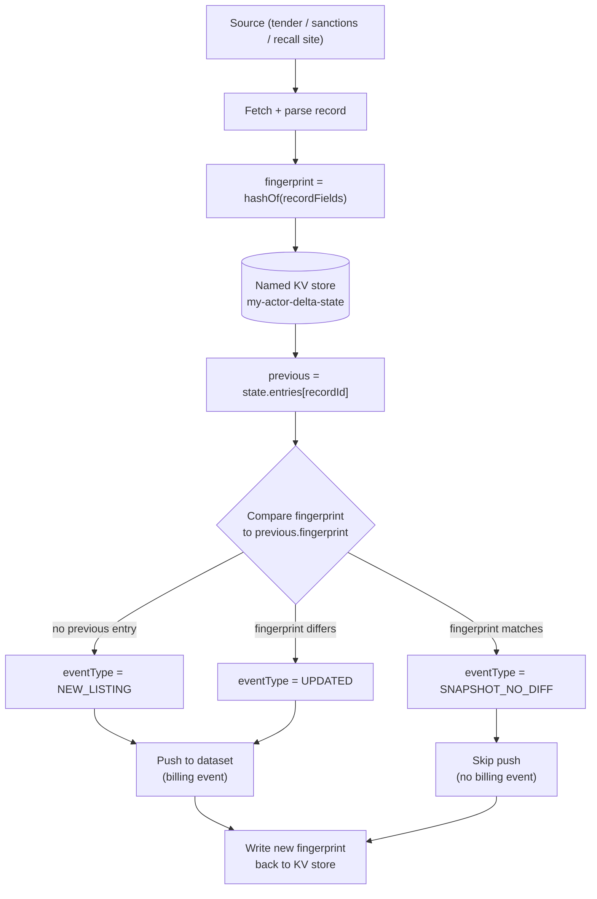

# DevRel Article 1: Zero-Idle-Cost Regulatory Monitoring

## Dev.to / Medium version

**Title:** Building a Zero-Idle-Cost Regulatory Compliance Pipeline on Apify

**Tags:** #webscraping #compliance #apify #nodejs #typescript

---

*This is an enhanced edition of the original article with an added architecture diagram and Python example; the underlying technical content is unchanged.*

### The problem with most compliance monitoring tools

Most sanctions/recall/tender monitoring setups fall into one of two traps: either you poll a source on a fixed schedule and pay for the full extraction every single time (even when nothing changed), or you build your own diffing layer on top of a raw scraper and end up maintaining state-management code that has nothing to do with your actual business logic.

I run a fleet of 17 Apify Actors covering government tenders, sanctions lists, patent disputes, and drug-safety recalls. Here's the pattern that got the recurring cost down to "you only pay for what changed" — without writing a separate database or state service.

### The core mechanism: a named key-value store

Apify gives every Actor run access to key-value storage. The default one is scoped to that single run — it doesn't survive to the next scheduled execution. The fix is one line:

```typescript
// Wrong - this store is isolated per run, gone by the next scheduled execution
const value = await Actor.getValue('my-key');

// Right - this store persists across every run of this Actor
const store = await Actor.openKeyValueStore('my-actor-delta-state');
const value = await store.getValue('my-key');
```

This distinction is worth calling out because the failure mode is silent — your code runs fine, your tests pass (if your tests don't span two separate runs, which most don't), and it's only when you check billing or watch data across a real second scheduled run that you notice nothing persisted. I found and fixed exactly this bug mid-migration on one of my own actors, caught only because I insisted on running two genuinely separate cloud executions and checking the real billing ledger, not just trusting a green local test suite.

### The pattern: fingerprint, classify, skip

For each record fetched:

```typescript
const fingerprint = hashOf(recordFields); // sha1 over the mutable fields
const previous = state.entries[recordId];

const eventType = !previous
    ? 'NEW_LISTING'
    : previous.fingerprint !== fingerprint
      ? 'UPDATED'
      : 'SNAPSHOT_NO_DIFF';
```

When your delta flag (call it `onlyNew`, `onlyChanged`, whatever fits your domain) is enabled, a record classified `SNAPSHOT_NO_DIFF` is never pushed to the dataset and never triggers a billing event. Not billed at a reduced rate — never delivered at all. That's the actual cost mechanism: you're not paying less for old data, you're not being charged for it in the first place.

#### The mechanism as a diagram

The whole delta-tracking loop reduces to one fetch, one fingerprint compare against the named KV store, one classification, and one conditional push:



The only two exits that reach the dataset are `NEW_LISTING` and `UPDATED`. `SNAPSHOT_NO_DIFF` dead-ends at the KV-store write with no push and no charge — that's the diagram's whole point.

### The completeness trap

If you also want to detect "this record disappeared" (a closed tender, a delisted sanctioned entity), you can only trust an absence as meaningful if your fetch was a **complete census** of the source. If your source is paginated and you cap your walk at `maxItems`, a record you didn't reach isn't "gone" — you just didn't get there.

I hit this exact bug on a real government tender site: the original code computed "was this walk complete" as a boolean checked *inside* the pagination loop, which failed silently at the exact boundary where a page returned precisely `maxItems` results with no overflow. The fix: compute completeness *once, after the walk finishes*.

```typescript
// Wrong - misses the exact-fill boundary case
let truncated = false;
for (const page of pages) {
    if (results.length >= maxItems) { truncated = true; break; }
}

// Right - computed once, after the walk, can't miss a boundary
const truncated = results.length >= maxItems;
```

### The result

Across this fleet, a scheduled monitor's first ("cold") run establishes a baseline at full cost. Every run after that only charges for what actually changed — directly observable from the Apify runs API's `chargedEventCounts` field, not a marketing number.

### Calling this from Python: `apify-client`

Everything above is what runs inside the Actor. If you're triggering one of these monitors and pulling results from outside — a Python pipeline, a notebook, a cron job that isn't itself an Apify Actor — the same delta behavior is visible through `apify-client`: you pass the delta flag in as run input, and when you iterate the dataset afterward you only ever see the `NEW_LISTING` and `UPDATED` records, because `SNAPSHOT_NO_DIFF` records were never pushed in the first place.

```python
from apify_client import ApifyClient

client = ApifyClient("<APIFY_API_TOKEN>")

# Trigger a run of one of the fleet's compliance-monitor actors, with the
# same delta flag described above ("onlyNew" / "onlyChanged", whatever the actor calls it)
run = client.actor("your-username/tender-monitor-actor").call(
    run_input={
        "onlyChanged": True,   # gate: SNAPSHOT_NO_DIFF records are never pushed
        "maxItems": 500,
    }
)

# Only NEW_LISTING and UPDATED items ever land in the dataset -
# a SNAPSHOT_NO_DIFF record dead-ends inside the actor and never shows up here
for item in client.dataset(run["defaultDatasetId"]).iterate_items():
    print(item["eventType"], item.get("recordId"))

# The actual cost signal - read straight from the runs API, not a marketing number
print(run["chargedEventCounts"])
```

`run["chargedEventCounts"]` is the same field referenced above: it's what lets you verify, from outside the Actor, that a `SNAPSHOT_NO_DIFF` classification really did cost nothing — instead of taking that on faith from the Actor's own logs.

---

## Hacker News "Show HN" draft

**Title:** Show HN: A named-KV-store pattern that made 17 compliance scrapers bill $0 for unchanged data

**Submission URL:** (link to the Dev.to/Medium post above, or the GitHub repo)

**First comment (post immediately after submitting, standard Show HN practice):**

Hi HN — I run a fleet of 17 Apify Actors covering government tenders, OFAC sanctions, patent disputes, and drug recalls. The interesting part isn't the scraping, it's the delta-tracking: a named (not default) key-value store persists a per-record fingerprint across scheduled runs, so a record identical to last time is never re-delivered or re-charged.

The one subtlety that actually mattered: Apify's default key-value-store helper (`Actor.getValue()`) is scoped to the *current run* — it silently doesn't persist to the next scheduled execution. Easy to miss because nothing errors; your tests pass, your run succeeds, and it's only checking the real billing ledger across two separate runs that reveals nothing persisted. Found and fixed this exact bug on one of my own actors mid-project.

Also wrote up the completeness-gating logic needed to make "this record disappeared" a trustworthy signal rather than a false positive from partial pagination — happy to go deeper on that in the comments if useful.
